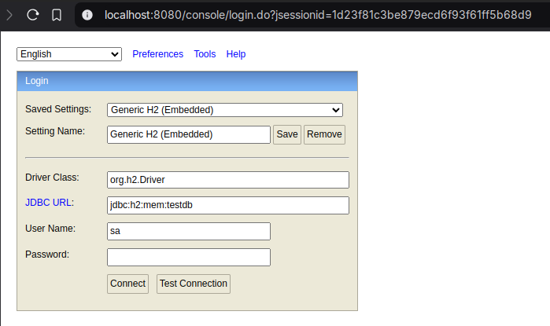

## Parte 01: Iniciando projeto

### O que é Spring boot 

[Documentação do Spring Framework](https://spring.io/).

**Spring**: Framework Java para facilitar o desenvolvimento de aplicações, oferecendo módulos como **Spring MVC, Spring Data e Spring
Security**. Requer mais configurações manuais.

**Spring Boot**: Extensão do Spring que automatiza configurações, inclui um servidor embutido (Tomcat, Jetty) e simplifica o desenvolvimento
de aplicações, especialmente microsserviços.

Em resumo, Spring é a base, enquanto o Spring Boot facilita e agiliza o desenvolvimento.

### Como criar uma aplicação

A criação pode ser feita de algumas formas diferentes, nós vamos passar por 2 delas:

- utilizando o site do String Initializr -> https://start.spring.io/
- criando diretamente pelo IntelliJ IDE

Dependências que utilizaremos:

- Obrigatórias:
    - **Spring Data JPA**: facilita a integração do Spring com o JPA, simplificando o acesso ao banco de dados
    - **H2 Database:** banco de dados que armazena os dados memória, em tempo de execução
    - **Spring Web:** permite criar APIs REST e aplicações web com suporte a HTTP
- Opcionais:
    - **Spring Boot DevTools (opcional):** restart automático de aplicação, LiveReload e outras configurações
    - **Lombok (opcional):** ajuda a reduzir a quantidade de código a ser digitado
    - **Validation (opcional):** fornece anotações para validar dados de entrada em entidades

### Estrutura de pastas

```
📦 meu-projeto
 ┣ 📂 src
 ┃ ┣ 📂 main
 ┃ ┃ ┣ 📂 java/com/exemplo
 ┃ ┃ ┃ ┣ 📜 MeuProjetoApplication  → Arquivo principal do projeto.
 ┃ ┃ ┣ 📂 resources
 ┃ ┃ ┃ ┣ 📜 application.properties → Configuração da aplicação.
 ┃ ┃ ┃ ┣ 📂 static      → Arquivos estáticos (CSS, JS, imagens).
 ┃ ┃ ┃ ┣ 📂 templates   → Templates HTML para aplicações com Thymeleaf.
 ┃ ┗ 📂 test            → Testes unitários e de integração.
 ┣ 📜 pom.xml           → Dependências do Maven.
 ┣ 📜 mvnw/mvnw.cmd     → Wrapper do Maven.
 ┗ 📜 .gitignore        → Arquivos ignorados pelo Git.

```

### Arquivo de configuração (application.properties)

Vamos utilizar essas configurações:

```
spring.application.name=todo-list  
  
# Configuracao banco de dados  
spring.h2.console.enabled=true  
spring.h2.console.path=/console  
spring.datasource.url=jdbc:h2:mem:testdb
spring.jpa.hibernate.ddl-auto=update
```

Explicando cada configuração:

`spring.h2.console.enabled=true` -> habilita o console do banco H2

`spring.h2.console.path=/console` -> define qual é o caminho para acessar o console

`spring.datasource.url=jdbc:h2:mem:testdb` -> url do banco H2
`jdbc` ->  indica o tipo de conexão: java database connectivity
`h2` -> especifica o banco de dados que será utilizado
`mem` -> indica que o banco será criado em memória
`testdb` -> nome do banco de dados

🤯 **Curiosidade**: da para usar outras formas, como, por exemplo, em arquivos: `spring.datasource.url=jdbc:h2:file:./data/testdb`

### Rodando a aplicação pela primeira vez e conhecendo o console do banco H2

O caminho para acessar ao console do H2 vai ser, por padrão: `http://localhost:8080/` + `contexto indicado`, no nosso caso, indicamos no *
*application.properties** que é `/console`, então o caminho final é `http://localhost:8080/console`. Como não valor definir nenhum nome de
usuário e senha, podemos apenas clicar em `connect` para acessar o banco, sem inserir nenhum dado adicional.

*Obs.: caso você mude a porta na qual o Spring vai rodar (por padrão 8080), consequentemente a porta desse console também será atualizada
para a especificada.*


