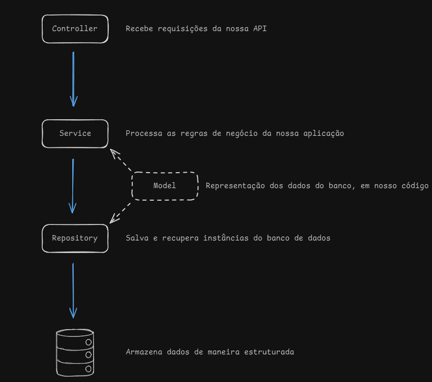

## Parte 01: Iniciando projeto

### O que é Spring boot 

[Documentação do Spring Framework](https://spring.io/).

**Spring**: Framework Java para facilitar o desenvolvimento de aplicações, oferecendo módulos como **Spring MVC, Spring Data e Spring
Security**. Requer mais configurações manuais.

**Spring Boot**: Extensão do Spring que automatiza configurações, inclui um servidor embutido (Tomcat, Jetty) e simplifica o desenvolvimento
de aplicações, especialmente microsserviços.

Em resumo, Spring é a base, enquanto o Spring Boot facilita e agiliza o desenvolvimento.

### Como criar uma aplicação

A criação pode ser feita de algumas formas diferentes, nós vamos passar por 2 delas:

- utilizando o site do String Initializr -> https://start.spring.io/
- criando diretamente pelo IntelliJ IDE

Dependências que utilizaremos:

- Obrigatórias:
    - **Spring Data JPA**: facilita a integração do Spring com o JPA, simplificando o acesso ao banco de dados
    - **H2 Database:** banco de dados que armazena os dados memória, em tempo de execução
    - **Spring Web:** permite criar APIs REST e aplicações web com suporte a HTTP
- Opcionais:
    - **Spring Boot DevTools (opcional):** restart automático de aplicação, LiveReload e outras configurações
    - **Lombok (opcional):** ajuda a reduzir a quantidade de código a ser digitado
    - **Validation (opcional):** fornece anotações para validar dados de entrada em entidades

### Estrutura de pastas

```
📦 meu-projeto
 ┣ 📂 src
 ┃ ┣ 📂 main
 ┃ ┃ ┣ 📂 java/com/exemplo
 ┃ ┃ ┃ ┣ 📜 MeuProjetoApplication  → Arquivo principal do projeto.
 ┃ ┃ ┣ 📂 resources
 ┃ ┃ ┃ ┣ 📜 application.properties → Configuração da aplicação.
 ┃ ┃ ┃ ┣ 📂 static      → Arquivos estáticos (CSS, JS, imagens).
 ┃ ┃ ┃ ┣ 📂 templates   → Templates HTML para aplicações com Thymeleaf.
 ┃ ┗ 📂 test            → Testes unitários e de integração.
 ┣ 📜 pom.xml           → Dependências do Maven.
 ┣ 📜 mvnw/mvnw.cmd     → Wrapper do Maven.
 ┗ 📜 .gitignore        → Arquivos ignorados pelo Git.

```

### Arquivo de configuração (application.properties)

Vamos utilizar essas configurações:

```
spring.application.name=todolist  
  
# Configuracao banco de dados  
spring.h2.console.enabled=true  
spring.h2.console.path=/console  
spring.datasource.url=jdbc:h2:mem:testdb
spring.jpa.hibernate.ddl-auto=update
```

Explicando cada configuração:

- `spring.h2.console.enabled=true` -> habilita o console do banco H2
- `spring.h2.console.path=/console` -> define qual é o caminho para acessar o console
- `spring.datasource.url=jdbc:h2:mem:testdb` -> url do banco H2
    - `jdbc` ->  indica o tipo de conexão: java database connectivity
    - `h2` -> especifica o banco de dados que será utilizado
    - `mem` -> indica que o banco será criado em memória
    - `testdb` -> nome do banco de dados

🤯 **Curiosidade**: da para usar outras formas, como, por exemplo, em arquivos: `spring.datasource.url=jdbc:h2:file:./data/testdb`

### Rodando a aplicação pela primeira vez e conhecendo o console do banco H2

O caminho para acessar ao console do H2 vai ser, por padrão: `http://localhost:8080/` + `contexto indicado`, no nosso caso, indicamos no *
*application.properties** que é `/console`, então o caminho final é `http://localhost:8080/console`. Como não valor definir nenhum nome de
usuário e senha, podemos apenas clicar em `connect` para acessar o banco, sem inserir nenhum dado adicional.

*Obs.: caso você mude a porta na qual o Spring vai rodar (por padrão 8080), consequentemente a porta desse console também será atualizada
para a especificada.*


## Parte 2: Criando model e repository

Agora que já configuramos nosso projeto, vamos criar a classe **Task** (modelo de dados) e o **repositório** para interagir com o banco de
dados. No entanto, primeiramente precisamos entender qual é a arquitetura e estrutura de projeto que utilizaremos aqui.

### **Hierarquia das classes na aplicação**

A aplicação segue a **arquitetura em camadas**, separando responsabilidades:



1. **Controller** → Recebe requisições da API e direciona para a camada de serviço.
2. **Service** → Contém a lógica de negócio, processando os dados antes de acessar o repositório.
3. **Repository** → Interage com o banco de dados, salvando e recuperando informações.
4. **Model** → Representa a estrutura dos dados da aplicação, refletindo as tabelas do banco.

### Código da classe Task

Abaixo está a implementação da classe **Task**, que representa uma tarefa na nossa aplicação:

```java
package com.project.todolist.model;

import com.fasterxml.jackson.annotation.JsonFormat;
import com.fasterxml.jackson.annotation.JsonProperty;
import jakarta.persistence.*;
import jakarta.validation.constraints.Size;
import lombok.AllArgsConstructor;
import lombok.Getter;
import lombok.NoArgsConstructor;
import lombok.Setter;

import java.time.LocalDateTime;

@Getter
@Setter
@AllArgsConstructor
@NoArgsConstructor
@Entity
public class Task {

    @Id
    @GeneratedValue(strategy = GenerationType.IDENTITY)
    @JsonProperty(access = JsonProperty.Access.READ_ONLY)
    @Column(unique = true, nullable = false, updatable = false)
    private Long id;

    @Size(min = 1, max = 50)
    @Column(nullable = false)
    private String title;

    @Column
    private String description;

    @JsonFormat(pattern = "yyyy-MM-dd hh:mm")
    @Column
    private LocalDateTime dueDate;

    @Column
    private boolean isCompleted = false;
}
```

### Explicações sobre Task

#### **Anotações usadas**

- **@Getter e @Setter** → Vêm do Lombok e geram automaticamente os métodos getter e setter para todos os campos da classe, reduzindo a
  necessidade de código boilerplate.
- **@AllArgsConstructor e @NoArgsConstructor** → Também do Lombok, geram construtores: um com todos os atributos e outro sem argumentos.
- **@Entity** → Indica que a classe é uma entidade JPA, ou seja, será mapeada para uma tabela no banco de dados.
- **@Id** → Define o identificador único da entidade, ou seja, a chave primária da tabela.
- **@GeneratedValue(strategy = GenerationType.IDENTITY)** → Faz com que o ID seja gerado automaticamente pelo banco de dados, utilizando
  auto incremento.
- **@JsonProperty(access = JsonProperty.Access.READ_ONLY)** → Indica que o campo ID será somente leitura na serialização JSON, impedindo que
  seja definido manualmente em requisições.
- **@Column(unique = true, nullable = false, updatable = false)** → Define que o ID deve ser único, não nulo e imutável após a criação.
- **@Size(min = 1, max = 50)** → Garante que o título tenha entre 1 e 50 caracteres, evitando valores vazios ou longos demais.
- **@Column(nullable = false)** → Define que o título é obrigatório no banco de dados.
- **@JsonFormat(pattern = "yyyy-MM-dd hh:mm")** → Define o formato da data ao serializar/deserializar JSON, garantindo o padrão "ano-mês-dia
  horas:minutos".
- **@Column** → Especifica que os atributos description, dueDate e isCompleted também serão persistidos no banco, mesmo sem outras
  configurações.

#### Por que usamos @JsonFormat(pattern = "yyyy-MM-dd HH:mm:ss")?

O **LocalDateTime** pode ser serializado de várias formas para JSON. Para garantir um formato consistente, usamos
`@JsonFormat(pattern = "yyyy-MM-dd HH:mm:ss")`, assim os dados enviados e recebidos seguem esse padrão, evitando problemas de
compatibilidade.

Exemplo de saída JSON:

```json
{
  "id": 1,
  "title": "Comprar pão",
  "description": "Ir à padaria pela manhã",
  "dueDate": "2024-10-15 08:30:00",
  "completed": false
}
```

#### Por que usamos @JsonProperty(access = JsonProperty.Access.READ_ONLY)?

Essa anotação impede que o usuário defina manualmente o **ID** da tarefa na requisição. Assim, o banco de dados é o único responsável por
gerar esse valor.

Se tentarmos enviar uma requisição POST assim:

```json
{
  "id": 10,
  "title": "Estudar Spring Boot"
}
```

O campo `id` será ignorado, pois está marcado como **READ_ONLY**.

### Código da classe TaskRepository

Agora vamos criar a interface **TaskRepository**, que será responsável pela comunicação com o banco de dados:

```java
package com.project.todolist.repository;

import com.project.todolist.model.Task;
import org.springframework.data.jpa.repository.JpaRepository;
import org.springframework.stereotype.Repository;

@Repository
public interface TaskRepository extends JpaRepository<Task, Long> {
}
```

### Explicações sobre o repository

- **JpaRepository<Task, Long>** → Essa interface herda os métodos do **JpaRepository**, permitindo operações como salvar, buscar, deletar e
  atualizar tarefas sem precisar implementar manualmente. **Task** representa a classe que será mapeada para esse repository e **Long** é o
  tipo da sua chave primária (PK).
- **@Repository** → Indica que essa classe é um **repositório Spring**, responsável pela camada de acesso aos dados.